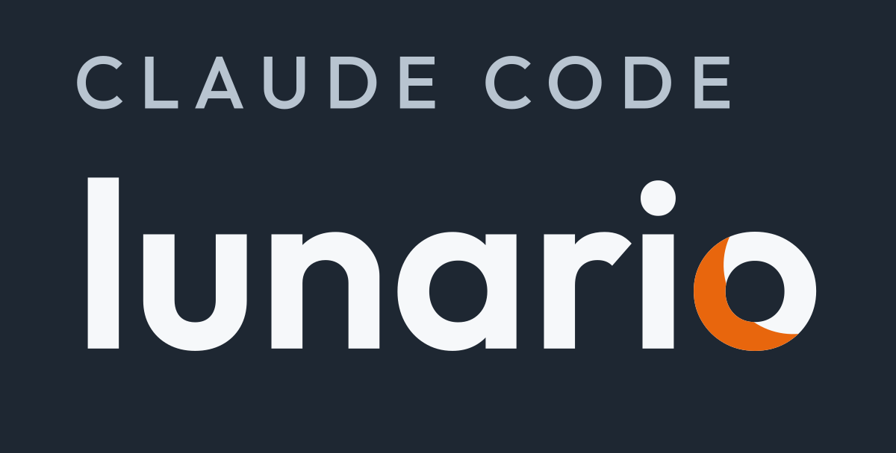

<p align="center">
  
</p>

<p align="center">
  <em>Il menu della settimana e la spesa in confezioni vere, non in grammi astratti.</em>
</p>

---

Lunario è un plugin per [Claude Code](https://claude.com/claude-code): il lunedì
gli racconti la settimana che hai davanti, lui ti prepara il menu dei sette
giorni e la lista della spesa; la domenica gli dici com'è andata e lui impara.

Non è un'app di diete con le opzioni: è un motore di regole universali — la
deperibilità del frigo, le porzioni CREA, i divieti — più un profilo che
descrive **la tua** famiglia. Cambiare vita si fa cambiando un file.

Di fatto è un *workflow domestico*: fasi in sequenza — pianifica, ritira,
cucina, correggi, impara — con lo stato su file di testo invece che nella
memoria della chat, e un passo di verifica che ritara quello dopo.

## La differenza

Un generatore di menu ti dice «1050 g di pasta». Lunario ti dice **«2 pacchi da
500 g, ne avanzano 400 per la settimana prossima»** — e la settimana dopo quei
400 g li sottrae dalla spesa. È la conversione da grammi a confezioni reali,
con una dispensa che si ricorda quello che hai in casa.

E il menu segue l'orologio del frigo: il pesce lunedì, le foglie martedì, i
legumi il venerdì. Gli ingredienti si consumano nell'ordine in cui si rovinano,
che è la regola che azzera lo spreco prima ancora di parlare di budget.

## Il giorno non è «pranzo e cena»

È una griglia **pasto × persona**, e ogni cella dice cosa succede davvero:

| stato | vuol dire |
|---|---|
| `casa` | si cucina, si compra, conta nelle calorie |
| `trasportabile` | idem, ma deve viaggiare e mangiarsi freddo |
| `libero` | si cucina e si compra, ma non conta: la pizza del sabato |
| `ristorante` | non si cucina e non si compra — però si paga, e si registra |
| `fuori` | mensa, bar, ospite: fuori dal sistema |
| `no` | quel pasto quella persona non lo fa |

Da qui vengono quattro cose che nessun generatore di menu fa. **Chi è a dieta
e chi no convivono nella stessa cena**, stesso piatto e porzioni diverse — e
se non è a dieta nessuno, la parola «deficit» non compare mai. **Il pasto
libero esiste e non si compensa**: non si taglia il pranzo perché la sera c'è
la pizza, che è il meccanismo per cui le diete diventano insopportabili.
**Colazione, spuntino e merenda contano** — due merende da 200 kcal per due
bambini fanno 2800 kcal a settimana, e un target che le ignora è un target
falso. E **il ristorante non sparisce dai conti**: non è spesa di Lunario, ma
è spesa alimentare, e finisce in un campo suo che risponde alla domanda che
nessun altro risponde — quanto costa mangiare, non quanto costa la spesa.

## Un lunedì qualunque

> **Tu:** prepariamo la settimana
>
> **Lunario:** Dal calendario: giovedì cena di lavoro tua, mercoledì nuoto dei
> bimbi fino alle 18.30 — quindi giovedì cucino solo per tre e mercoledì serve
> una cena pronta in 25 minuti. Torna? E ditemi se c'è una voglia, o qualcosa
> che non volete più vedere.
>
> **Tu:** torna. Siamo stufi del merluzzo, e venerdì viene a cena mia madre
>
> **Lunario:** Il merluzzo esce di rotazione per tre settimane. Venerdì
> aggiungo un posto a tavola, porzioni intere — e ci metto il risotto ai
> funghi, che con un ospite rende più di una vellutata. La pizza del sabato
> resta il vostro pasto libero: non la conto e non la compenso.
>
> **Tu:** ok. Ai bimbi le lenticchie di martedì non vanno giù
>
> **Lunario:** Le tengo, ma martedì la base dei bimbi è pasta al pomodoro e
> le lenticchie restano in tavola senza trattative: prima o poi le assaggiano.
> Ecco la settimana — il pesce lunedì che è fresco, il minestrone venerdì che
> fa piazza pulita del frigo — e la lista: 2 pacchi di fusilli Barilla da 500 g, la
> passata Mutti da 700 g, il Grana Padano che avete già in casa non lo
> ricompro…

<!-- SEGNAPOSTO: screenshot del menu HTML di una settimana vera.
     Lo genera l'autore da settimane/<ISO>.html e lo committa a mano.
     Non generarlo in modo sintetico: un menu inventato violerebbe la
     regola «mai inventare» che regge il progetto. -->

## Le otto skill

| skill | quando | cosa fa |
|---|---|---|
| `lunario:profilo` | una volta | ti intervista: chi siete, obiettivi, esclusioni. Bastano tre domande per partire — il resto si racconta strada facendo — o l'intervista completa per chi ha tempo. Calcola le calorie da peso e altezza, e costruisce la cartella |
| `lunario:ritmi` | quando cambia la vita | la settimana tipo: chi pranza fuori il martedì, quale sera c'è poco tempo |
| `lunario:settimana` | **il lunedì** | legge il calendario, ti chiede impegni, pasti già presi fuori casa, voglie e di cosa sei stufo, poi genera menu e spesa |
| `lunario:menu` | automatica | i 7 giorni e la lista in confezioni, in markdown e in HTML — da stampare, o da spuntare col dito al supermercato. Ogni riga dice a quali pasti serve |
| `lunario:spesa` | **al ritiro** | dallo scontrino: prezzi veri, cosa manca, alternative subito. Separa il menu dai detersivi, e da qui il menu non è più una previsione |
| `lunario:prepara` | **mentre cucini** | ingredienti, procedimento, un video se serve. Ti avverte se manca qualcosa, poi chiede difficoltà e voto del cuoco. Prima di cucinare fa anche l'anteprima: com'è questo piatto, qui, per voi |
| `lunario:correggi` | a settimana in corso | cambi idea? Ti propone cosa è rimasto e rifà solo i giorni che restano |
| `lunario:postmortem` | **la domenica** | legge cos'è successo davvero durante la settimana e chiede solo il resto: voti dei commensali e — se vuoi — il peso → ritara porzioni, rotazione e budget |

## Come impara, in concreto

Due domeniche di fila la stessa risposta al postmortem — «è avanzata pasta» —
e in `dati/storico.yaml` succede questo:

```yaml
# prima
tarature:
  porzioni_g: {}

# dopo
tarature:
  porzioni_g:
    Adulto1:
      pasta: 70      # era 80, avanzata due settimane su due
```

Dal lunedì successivo il fabbisogno si calcola sulla porzione nuova — e
siccome la lista ragiona in confezioni, prima o poi quei grammi in meno
diventano un pacco in meno. Nessuno ha aperto un file, nessuno ha «impostato»
niente: il sistema ha guardato la pentola.

## Il peso, se lo vuoi — e come non diventa un giudizio

Chi è a dieta può farsi chiedere il peso dal postmortem della domenica. È
opzionale, si sceglie al setup e **si può saltare ogni volta**, senza dover
spiegare niente: se non rispondi, Lunario va avanti e non registra nemmeno che
hai saltato.

Quello che ne fa è l'unica cosa che ha senso farne: **il trend su tre
settimane**, mai la singola misura. Il peso oscilla di 1-2 kg per acqua, sale
e sonno, e leggere la pesata di stamattina come un voto è il modo più rapido
di mollare tutto a febbraio. Sotto le tre pesate registra e tace. Se il calo va
troppo veloce — oltre un chilo a settimana per tre settimane — te lo dice e ti
manda dal medico, perché lì il ruolo di questo sistema finisce. E se
l'obiettivo è raggiunto, propone il passaggio a mantenimento invece di tenerti
a dieta per sempre.

Non commenta mai il numero. Niente «bravo», niente «sgarro», niente
«recuperare»: riporta un andamento, non giudica una persona.

## Le ricette che vi passano, e i nomi delle settimane

Un piatto che vi ha segnalato qualcuno si aggiunge dicendolo — «me l'ha
passata Marta», anche con un link o una foto. Finisce in `dati/ricette.md` con
ingredienti, quantità e calorie, e da lì è un piatto come gli altri: entra nel
menu, prende i voti, esce di rotazione se non piace. Le calorie seguono la
regola dei prezzi: se c'erano sulla fonte valgono così come sono, altrimenti
le stima Lunario e lo dice.

E ogni settimana ha un nome, per ritrovarla senza contare i numeri ISO. Puoi
scegliere il filone da cui pescarlo — canzoni dei Beatles, fiori, pesci
tropicali, cime delle Alpi — e Lunario prende l'elemento che risuona col menu
quando ce n'è uno: «Yellow Submarine» sulla settimana dei tre pesci.

## Nessuna dipendenza da un supermercato

Scelta di progetto, non provvisoria: niente integrazioni con servizi di spesa
online, niente scraping, niente abbonamenti. Due sole fonti, entrambe gratuite:

- **[Open Food Facts](https://world.openfoodfacts.org)** per il formato delle
  confezioni e i valori nutrizionali, interrogato per singolo prodotto e messo
  in cache
- **I tuoi scontrini** (PDF) per i prezzi, letti quando ritiri la spesa

Il prezzo dello scontrino batte qualsiasi listino, perché contiene già le
promozioni e gli sconti fedeltà che hai avuto davvero. E siccome la spesa si
ritira *prima* di cominciare a cucinare, lo scontrino serve a qualcosa di più
che ai prezzi: dice cosa non è arrivato, così l'alternativa si trova il lunedì
e non davanti al frigo il giovedì sera.

È anche il momento in cui il menu cambia natura. Fino a lì è un **preventivo**:
i formati, i prezzi e persino i piatti sono previsioni, e il totale non è una
spesa. Dopo lo scontrino è un **consuntivo**: prodotti veri, prezzi pagati,
sostituzioni già applicate ai giorni. Sono due documenti con due autorità
diverse, e il foglio sul frigo dice sempre quale dei due è — perché il numero
in fondo si legge in modo molto diverso.

Uno scontrino però non è la spesa di Lunario: contiene detersivi, carta casa e
la spesa fatta per qualcun altro. Le righe alimentari te le presenta come lista
**con le caselle già spuntate** — «era in lista», «già nel paniere», «mai
visto» — e tu correggi in una parola. Anche a metà: sei yogurt di cui tre della
suocera valgono mezza riga. E ciò che compri altrove — il pane dal panettiere,
le uova dal contadino — dopo la prima volta smette di risultare mancante.

### Quando il database non ti conosce

Open Food Facts è collaborativo, e sulla marca del supermercato la copertura
è reale ma parziale: interrogando la sua
[API di ricerca](https://world.openfoodfacts.org/api/v2/search?brands_tags=esselunga&fields=code&page_size=1)
(14 agosto 2026) i prodotti
censiti sono circa 2.100 per Esselunga, 3.200 per Coop, 2.900 per Conad e
3.000 per Carrefour in Italia, mentre Lidl ne ha 1.500 a proprio nome più
quelli dei suoi marchi (la sola Italiamo supera il migliaio). Sembrano numeri
discreti, ma anche quando il prodotto c'è manca spesso proprio il dato che
serve a Lunario: dei prodotti Esselunga censiti, meno della metà ha il
formato della confezione compilato.

Per questo la degradazione è un percorso previsto, non un incidente — e a
ogni gradino si dichiara, mai si inventa. Se il database non conosce il tuo
prodotto, Lunario lo chiede a te, che il pacco ce l'hai in dispensa: il
formato sta scritto sopra, le calorie sull'etichetta, e il dato dichiarato
entra nel paniere con la sua provenienza, valido come uno letto dal database.
Se non lo sa nessuno, la riga resta in grammi, marcata «formato da
verificare». E lo stesso vale per gli scontrini: se il PDF non si lascia
leggere, si va a voce — i prezzi che ricordi entrano come «dichiarati»,
quelli che nessuno ricorda restano buchi. Una riga onesta vale più di una
confezione inventata.

## Installazione

```bash
claude plugin marketplace add fporcari/claude-code-lunario
claude plugin install lunario@claude-code-lunario
```

Poi apri con Claude Code la cartella dove vuoi tenere i tuoi dati e lancia
`lunario:profilo`: l'intervista crea `dati/` e `settimane/` e ti guida.

Per aggiornare il motore quando esce una versione nuova:

```bash
claude plugin marketplace update claude-code-lunario && claude plugin update lunario@claude-code-lunario
```

Poi **riavvia Claude Code**: le skill si caricano all'avvio, e una sessione già
aperta continuerebbe con quelle vecchie. Se il tuo `dati/profilo.yaml` è
rimasto indietro di qualche versione, `lunario:profilo` lo aggiorna da solo —
converte i campi vecchi e ti chiede solo quello che non può dedurre.

## Dove finiscono i tuoi dati

Nella tua cartella, mai in questo repo. Il motore è pubblico, la tua famiglia
no:

```
~/dove-vuoi/lunario/
├── dati/
│   ├── profilo.yaml       chi siete, calorie, esclusioni
│   ├── ritmi.yaml         gli orari che si ripetono
│   ├── note.md            i vincoli che detti a voce
│   ├── ricette.md         i piatti vostri: quelli che vi hanno passato
│   ├── prodotti.jsonl     il tuo paniere: formati, nutrienti, prezzi
│   ├── dispensa.yaml      cosa è rimasto in casa
│   └── storico.yaml       settimane passate e tarature apprese
└── settimane/             i menu generati
```

Per tenerli altrove: `LUNARIO_DATI=/percorso/che/preferisci`.

La cartella è anche un **repo git locale, senza remote**: le skill committano
da sole quando hanno finito, così `git log` e `git diff` ti dicono cosa è
cambiato e quando, e si può tornare indietro. Nessun remote viene creato né
proposto — qui dentro ci sono pesi, obiettivi e abitudini di persone reali,
minori compresi, e un repo privato riduce il rischio ma non lo toglie: un dato
caricato non rientra. Per lavorare dal telefono non serve comunque: con
[`claude remote-control`](https://code.claude.com/docs/en/remote-control) la
sessione gira sul computer di casa e la guidi dal telefono, senza spostare un
file. Se il git non lo vuoi, `git: no` nel profilo.

## Le regole di casa

Un sistema AI affidabile si progetta prima di tutto per ciò che gli è vietato:

- mai inventare prodotti, formati, prezzi o valori nutrizionali — ciò che non
  si trova si dichiara mancante
- mai un prezzo senza data e provenienza: uno letto dallo scontrino e uno detto
  a voce valgono entrambi, purché si sappia quale è quale
- mai piani sotto le 1200 kcal al giorno a persona: sotto quella soglia serve
  un medico, non un modello
- mai ignorare un'esclusione alimentare, nemmeno come ingrediente nascosto
- mai toccare le note che hai scritto tu: il sistema può solo proporre
- mai commentare il corpo di qualcuno: delle pesate si guarda il trend su tre
  settimane, mai la singola misura, e la domanda della domenica si può sempre
  saltare senza spiegazioni

## Crediti

Porzioni e frequenze dalle [Linee Guida per una Sana Alimentazione, CREA rev.
2018](https://www.crea.gov.it/web/alimenti-e-nutrizione/-/linee-guida-per-una-sana-alimentazione-2018).
Dati prodotto da [Open Food Facts](https://world.openfoodfacts.org), licenza
ODbL.

Le calorie stimate sono indicative, non misure. Lunario non è un dispositivo
medico e non sostituisce il parere di un professionista.
